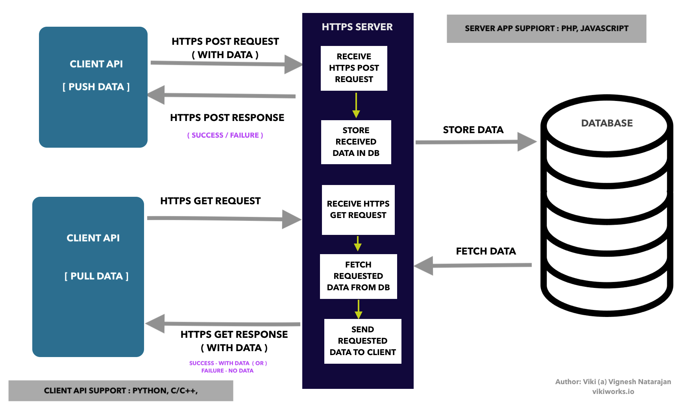

## IoT over HTTP/HTTPS

An architecture harnesses vastly deployed HTTP/HTTPS infrastructure for a cost-effective Internet of Things ecosystem.

Architecture Overview:

#### Server APP:

Server APP has to be deployed on an HTTP server

	-> server_app/php

#### Client API 

Client API can be called from any IoT device.

	-> client_api/python

#### DB Setup

Create a db with the following credentials

	define('DB_SERVER', '127.0.0.1:3306');
	define('DB_USERNAME', 'testdb');
	define('DB_PASSWORD', 'testdb123');
	define('DB_NAME', 'testdb');

Create a db table using the following command

	CREATE TABLE `testdb`.`vehicle_route_record` ( `id` INT NOT NULL AUTO_INCREMENT, `vehicle_id` VARCHAR(32) NULL , `time_received` TIMESTAMP(6) NOT NULL , `time_sent` DATETIME(6) NOT NULL , `gps_lat` DOUBLE , `gps_lon` DOUBLE , `speed` DOUBLE NULL , PRIMARY KEY (`id`)) ENGINE = InnoDB;

Note:

Presently client api is written in python and the server app is written in php. I am planning add support for other programming languages such as C/C++, Javascript etc.

